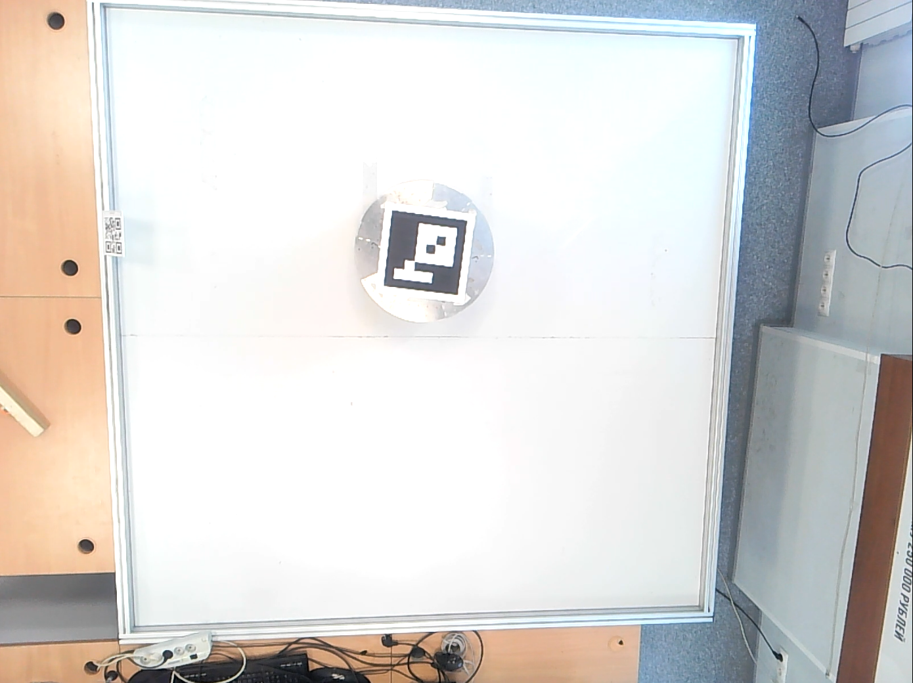
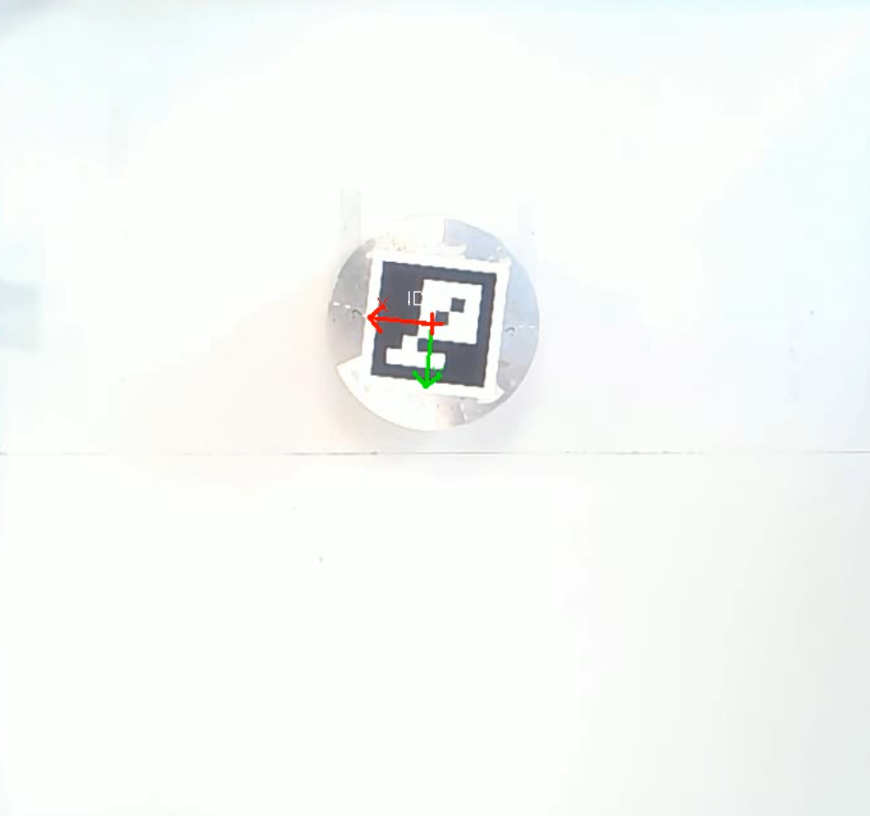
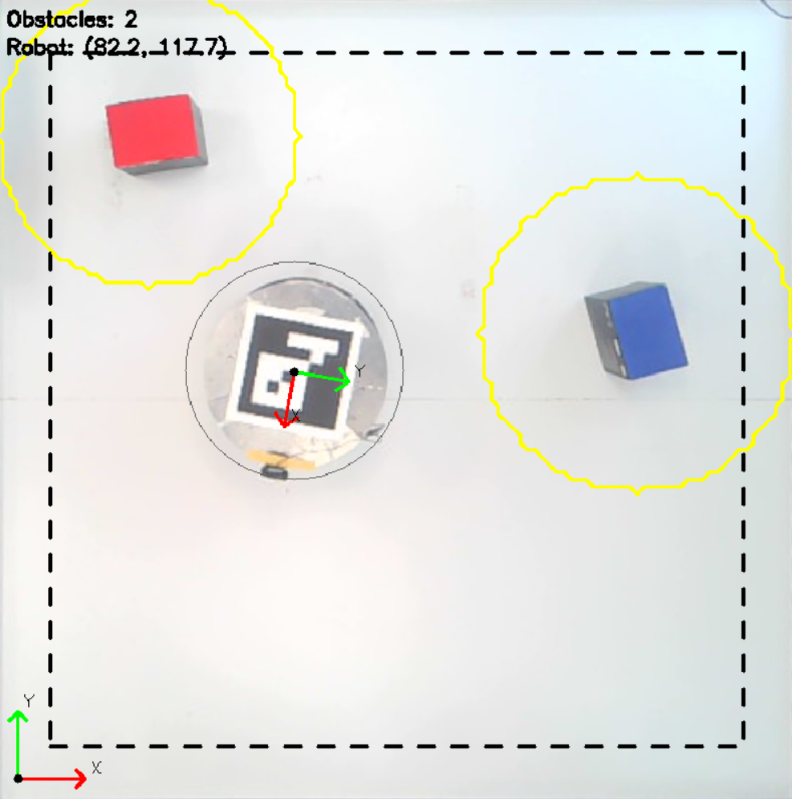
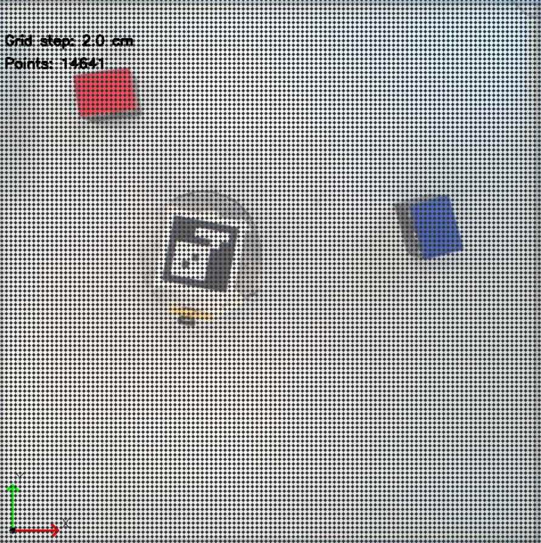
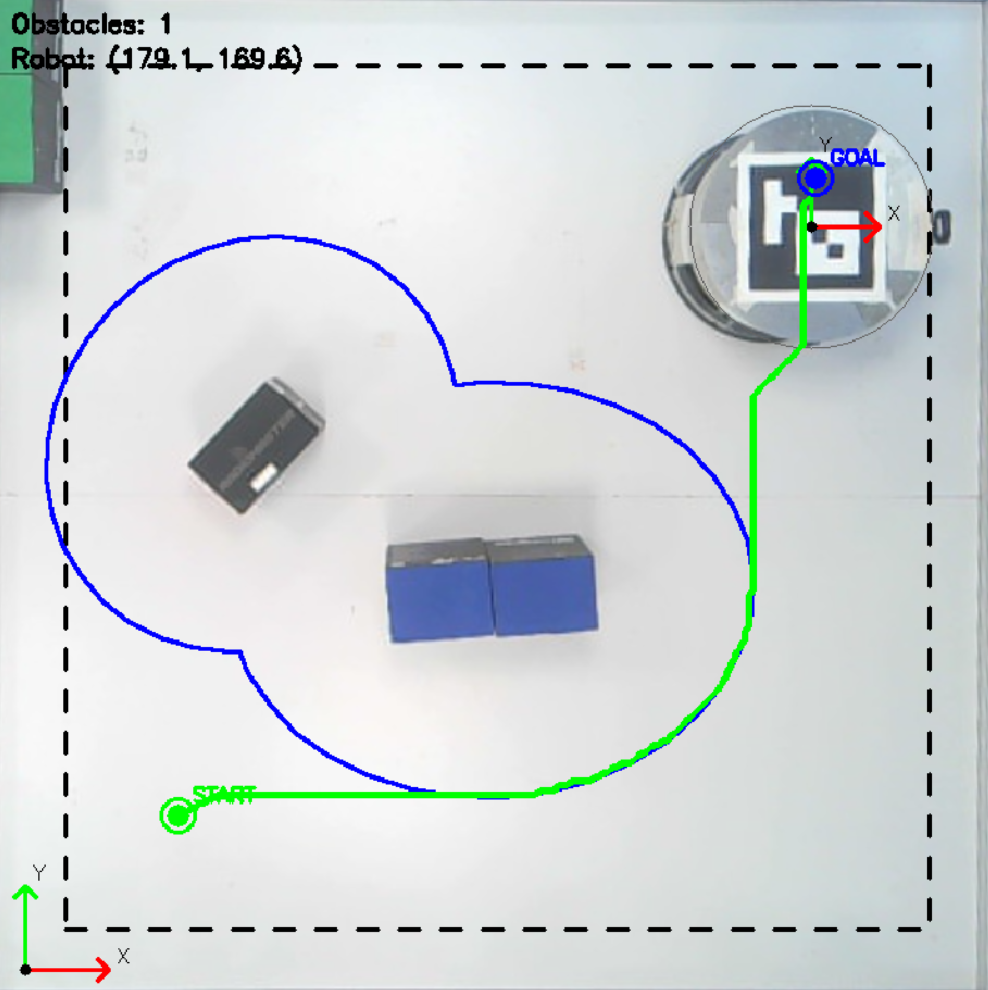
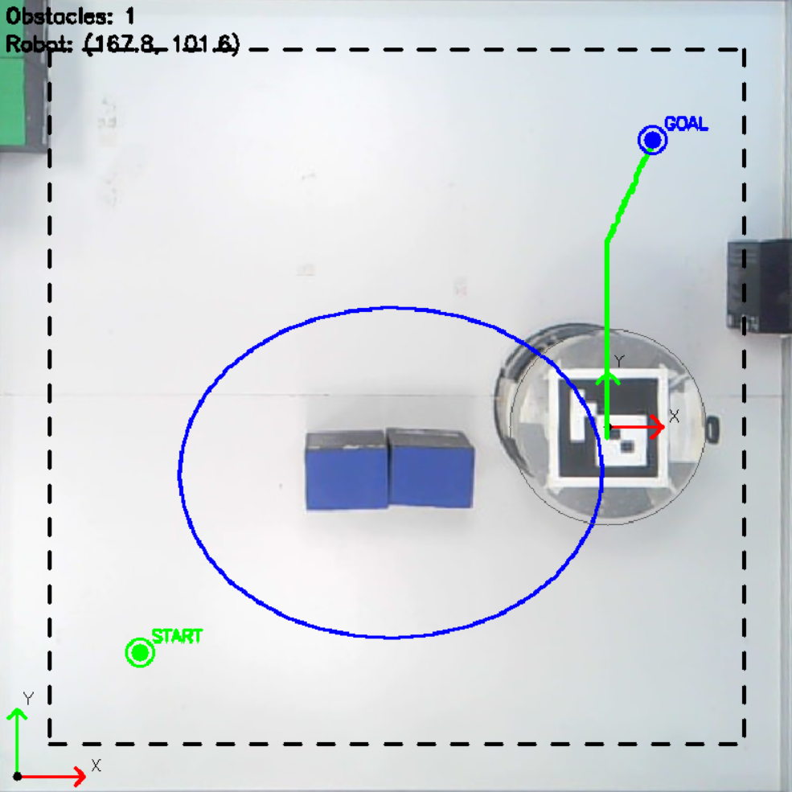

# Обход подвижных препятствий мобильным роботом
## Задание

На мобильном роботе необходимо реализовать алгоритм динамического обхода препятствий, в качестве метода А*. Препятствия на поле движутся, поэтому роботу необходимо перестраивать маршрут в зависимости от изменений на поле.

Над полем, по которому движется робот, установлена камера, транслирующая видео. По диагонали на поле установлены начальная и конечная точка для робота. Определяя препятствия и объезжая их, робот курсирует из начальной точки в конечную и обратно.

## Обработка видеопотока

Первым этапом будет работа с видеопотоком. Необходимо:
- Провести предобработку видеопотока, выровнять изображение с камеры;
- Идентифицировать положение робота;
- Определить препятствия на поле;
- Реализовать возможность задания координат конечной точки по видеопотоку.

Так как камера установлена не ровно, для обеспечения соответствия определяемых координат робота и препятствий реальным - необходимо выровнять кадры таким образом, чтобы соблюсти реальные пропорции поля. Такая обработка называется гомографией: это математическое преобразование, переводящее точки из одной плоскости в другую с учетом перспективы. Для вычисления гомографии указываются 4 угла поля на первом кадре вручную - они должны расположиться в углах квадрата 720×720 пикселей, т.к. известно, что поле квадратное.

Так как поле и камера статичны, а размеры поля известны - углы записываются в отдельном файле для дальнейшего выравнивания кадров видеопотока и не изменяются без необходимости.

  
  

Для определения положения робота в пространстве и определения его локальной системы координат относительно глобальной системы координат (системы координат поля) будет использоваться AruCo-метка на поверхности робота. ArUco метка - маркер, который используется в компьютерном зрении для определения положения объектов в пространстве. Она представляет собой черно-белое изображение, состоящее из внешней черной рамки и внутренней бинарной матрицы, которая кодирует уникальный идентификационный номер. По ArUco-метке выбираются оси для связной системы координат робота таким образом, чтобы они совпадали с осями координат робота (они изображены на роботе). Результат распознавания метки и оси координат робота представлены на рисунке 1-б.

Контура препятствий выделяются с помощью настройки бинарной маски: таким образом объекты будут распознаваться вне зависимости от цвета. Кадр переводится в оттенки серого, после чего к нему применяется пороговая обработка: в зависимости от значения порога менее яркие пиксели ярче него становятся белыми, а более яркие - черными. Для обработки применяются морфологические операции открытия и закрытия. Операция открытия проводит сначала эрозию, а потом дилатацию, а операция закрытия - сначала дилатацию, а потом эрозию. Эрозия - это метод обработки изображений, который уменьшает или сужает объекты, а дилатация в свою очередь расширяет границы объектов. Это позволяет убрать мелкие объекты и шумы с кадров, исключить из обработки мелкие тени и блики света и выделить основные контура. 

Для каждого выделенного контура вычисляется площадь, проверяется на соответствие размера объекта границам размера препятствия, после чего определяется центр объекта. Далее на препятствии выделяется прямоугольник и определяются его длина и ширина, по которым поверх строится фигура эллипса: это сделано для того, чтобы в случае выставления длинных препятствий на поле безопасное расстояние до препятствия формировалось равномерно в соответствии с его размерами. 

Размер эллипса, по которому в итоге строится маршрут, формируется из радиуса робота и дополнительного расстояния, которое можно прибавить в зависимости от условий выполнения задания.

Эллипс строится по точкам, на которые разбивается поле для построения маршрута (о точках будет написано в следующем разделе). На видео также стоит граница от края кадра: это необходимо потому, что робот перемещается в заданную точку своим центром, поэтому если будет поставлена точка на краю кадра - робот не сможет в нее приехать и врежется в край поля.

  

В результате на видео выводятся:
- контура препятствий с запасом по расстоянию;
- контур робота;
- контур по краю кадра;
- количество препятствий;
- координаты робота;
- стартовая и целевая точки.

## Алгоритм и условия движения

Так как большинство методов построения маршрута являются графовыми (или дискретными), то есть строятся по точкам - то обрабатываемый кадр разбивается на точки, по которым будет строиться путь. В зависимости от заполнения кадра точками маршрут будет строиться точнее, но дольше.

  

Так как сравнение алгоритмов, приведенное в предыдущей работе, показало, что время, затрачиваемое A* на построение маршрута - мало, относительно того, с какой скоростью движется робот, поэтому принято решение для реализации алгоритма динамического обхода препятствий использовать его.

Алгоритм A* работает с сеткой, где каждая клетка - это узел графа, а переходы между соседними клетками имеют веса, равные евклидову расстоянию (диагональные ходы имеют больший вес). Ключевое отличие A* заключается в использовании эвристической функции, которая оценивает расстояние от текущей клетки до цели. В начале работы алгоритма всем узлам присваивается бесконечная фактическая стоимость от старта, за исключением стартовой точки, которой присваивается ноль. Также для стартовой точки вычисляется эвристика, и сумма стоимости с эвристикой помещается в приоритетную очередь. На каждом шаге алгоритм извлекает из очереди узел с наименьшим значением суммы. Если этот узел является целевой точкой, алгоритм завершается и восстанавливает путь по родительским ссылкам. В противном случае для всех соседей текущей клетки вычисляется новая стоимость как сумма стоимости текущего узла и веса ребра к соседу. Если новая стоимость оказывается меньше записанной стоимости для соседа, то обновляется стоимость соседа, пересчитывается его эвристика и сумма, родителем соседа становится текущая клетка, и сосед добавляется в очередь. Благодаря эвристике A* направляет поиск в сторону цели, что делает его значительно быстрее алгоритма Дейкстры на больших картах, при этом сохраняется гарантия оптимальности при условии, что эвристика является допустимой.

При изменении конфигурации препятствий активируется механизм перепланирования с заданным интервалом: карта препятствий полностью перестраивается на основе новых данных с камеры, после чего алгоритм A* заново строит маршрут от текущего положения робота до целевой точки. Если путь успешно найден, он заменяет старый, и робот продолжает движение по обновленной траектории. Если же путь не найден, робот останавливается и переходит в режим ожидания, продолжая попытки перепланирования до тех пор, пока путь не станет доступен. Дополнительно реализован механизм выезда из препятствия: если робот оказывается внутри занятой клетки, алгоритм ищет ближайшую точку на границе контура, выбирая точку, максимально близкую к роботу и ориентированную в направлении к цели. Для решения этой задачи реализована весовая функция, определяющая, что важнее, выезд из препятствия или движение по направлению к цели.

На основе построенного пути формируются скорости с помощью П-регулятора: алгоритм находит ближайшую к роботу точку на пути, затем целевую точку на некотором расстоянии вперёд, и линейная скорость вычисляется пропорционально ошибке расстояния до этой целевой точки, ограниченная максимальным значением. После того как робот приближается к финальной цели на расстояние меньше заданной допустимой ошибки, движение считается завершенным.

В процессе отладки приняты следующие условия:
- так как на кадре изображено привычное расположение осей координат, а на роботе ось Y направлена в противоположную сторону - то скорость на робота подается с минусом;
- робот будет двигаться голономно, поэтому угловая скорость равна 0, а оси координат должны совпадать с осями глобальной системы координат (быть им параллельными).

Для соблюдения второго условия перед началом движения робота по пути добавлена проверка: если ошибка по углу ориентации больше некоторого значения, то робот сначала выравнивает угол, а потом едет.

Robotino имеет встроенный веб-сервер, который принимает HTTP-запросы для управления движением по Wi-Fi. Адрес для отправки команд - /data/omnidrive. Полный URL выглядит так: http://192.168.0.1/data/omnidrive, где 192.168.0.1 - это IP-адрес робота в локальной сети. Тело запроса представляет собой JSON-массив из трёх чисел: [vx, vy, omega].

В результате маршрут перестраивается каждую итерацию, и изменяет управление,  что позволяет роботу реагировать на изменения на поле. Пример реакции робота на добавление и удаление препятствий на поле представлены на рисунке 4.

  
  

## Заключение

В результате выполнения лабораторной работы была разработана система управления с техническим зрением для навигации мобильного робота Robotino на ограниченном поле с препятствиями. Робот обнаруживается с помощью использования AruCo-метки, препятствия детектируются с помощью бинарной маски с последующим выделением контуров и построением эллиптических областей безопасности. Реализован алгоритм A* для построения оптимального маршрута к цели с учётом статических и динамических препятствий. Предусмотрен механизм периодического перепланирования маршрута, позволяющий роботу адаптироваться к изменению окружающей обстановки в реальном времени, а также механизм выезда из зоны препятствия при случайном попадании внутрь контура. 